# Preparing Satellite Data for Wildfire Detection with Oxen.ai 🔥🛰️
### Introduction
There are few domains with a greater quantity of high-quality, publicly accessible data than Earth-observing satellite imagery. Government-funded missions such as  [LANDSAT](https://www.usgs.gov/landsat-missions#:~:text=Since%201972%2C%20Landsat%20satellites%20have,natural%20resources%20and%20the%20environment.) (USGS / NASA) and [SENTINEL](https://sentinel.esa.int/web/sentinel/missions/sentinel-2) (ESA) have captured and transmitted terabytes of this data every day for multiple decades, providing an extremely rich resource to those wishing to develop models for pressing geospatial challenges like disaster response. 

Researchers have built and meticulously annotated domain-specific datasets from this vast array of satellite imagery, such as [this dataset](https://drive.google.com/drive/folders/1GIcAev09Ye4hXsSu0Cjo5a6BfL3DpSBm) for space-based active fire detection introduced in [this paper by Pereira et. al](https://arxiv.org/abs/2101.03409).

While these datasets are information-rich and freely available, they are notoriously difficult to collaborate on and develop models with due to a few key factors: 

**Dataset size**

The SENTINEL-2 and LANDSAT-8 constellations capture imagery of the full global landmass (>57 million mi^2) every 5 and 16 days respectively. That's an enormous amount of data even with regular 3-channel RGB imagery—but these sensors also record outside the visible spectrum, meaning that each image has >10 channels and is as such >3x more storage-intensive than an RGB image of the same pixel dimensions. 

This makes these datasets highly impractical to collaborate on as teams might on a spreadsheet, passing around different full copies of a single file each time they make a change.

**Data-label linking**

Raw satellite images (called "scenes") are usually transmitted as large, >6000x6000 pixel images covering tens of thousands of square kilometers. Modelers then extract smaller "patches" or "chips" (i.e., 256x256 pixels) from these scenes to use as training data. 

Strategies for performing this chipping vary, and it's easy to lose track of what chip came from which scene, was generated under which chipping strategy, and matches with which label or segmentation mask.


### Finding a better way 
In this tutorial, we'll use Oxen to address both of these common pitfalls in working with satellite imagery. In doing so, we'll transform a widely-cited dataset for wildfires detection from a 10GB Google Drive-hosted .zip file collection to a cloneable, well-organized [Oxen.ai](www.oxen.ai) data repository ready for collaborative model development.

## The Dataset 
We'll be walking through how to prepare [this excellent dataset](https://drive.google.com/drive/folders/1GIcAev09Ye4hXsSu0Cjo5a6BfL3DpSBm) (introduced in [this paper by Pereira et. al](https://arxiv.org/abs/2101.03409)) for space-based active fire detection.

This dataset contains patches of imagery extracted from LANDSAT-8 satellite imagery across Earth, many of which contain actively burning wildfires. 

While the authors processed the full 1.6TB of imagery captured by LANDSAT-8 in August 2020 (targeting peak fire season), we're primarily interested in the excellent subset of data for which they manually created segmentation masks denoting active burn. 

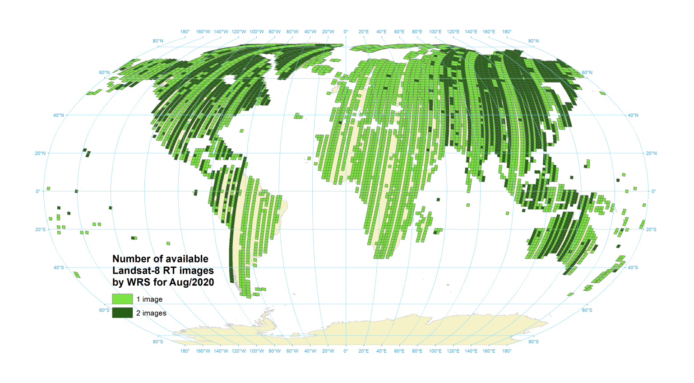

In addition to being a more manageable (12GB) dataset size for model fine-tuning and evaluation applications, these human-verified labels will give any downstream models the best possible signal with which to learn to detect fires in novel imagery.

 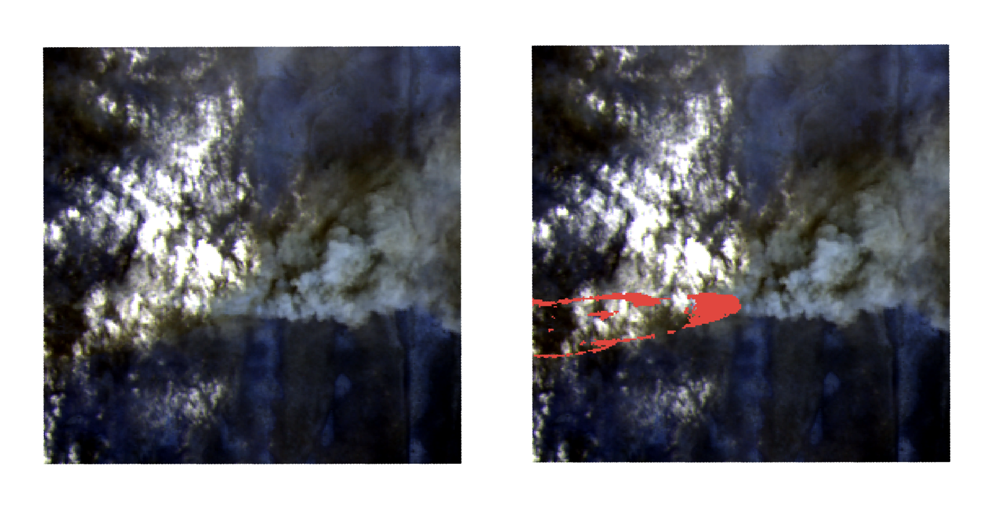


To supplement these ground-truth manual annotations, the researchers include 5 auto-generated segmentation masks that don't require any direct human input. These are generated computationally, using algorithms previously developed and validated in the remote sensing literature. While less precise than the manual annotations, these can also be a useful reference point for model validation.

**Data access pre-Oxen**
The authors use a [GitHub repository](https://github.com/pereira-gha/activefire/tree/main) to distribute the dataset, but the only data currently hosted there are a 77-row metadata file called `images2020009.csv` (we'll come back to this shortly) and some download scripts to fetch the full dataset from .zip files Google Drive.

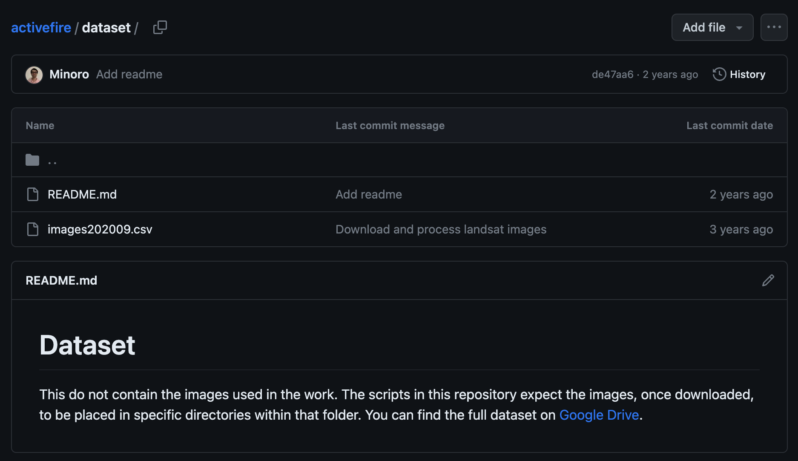


### 🐂 📈 Oxen Repository >>> Zip Files 
We see two primary areas in which we can better ready this dataset for collaborative model development. 

**1. Enable atomic changes.** If we want to add, modify, or remove 50 MB of data from this dataset, we should only have to push (and our colleagues subsequently pull) 50 MB — not the whole 10 GB zip file. 

If we identify a mistake and want to roll these changes back, we shouldn't have to hunt for the `DATA_VERSION_3_FINAL.zip` taking up extra storage on our drive - instead, we'll leverage Oxen's version control to seamlessly undo the change. 

**2. Improve data-label linking.** The source data and 6 human + computed label sets are currently linked somewhat tenuously through pattern matching in the image file paths. We'll nail this down to an authoritative, well-validated data -> labels mapping file to save our teammates some meticulous ETL work and speed up the model development process. 


### Making the data modeling-ready with Oxen

#### 1. **Enabling atomic, versioned dataset collaboration**
We want to enable our team to efficiently iterate on this data throughout the duration of the wildfire detection project. In this dataset's original distribution via a collection of .zip files hosted on Google Drive, any changes, however small, to the source data would require a recompression and re-upload of the 10GB data folder.

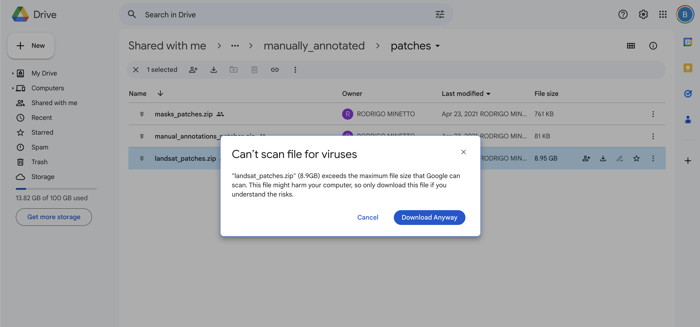

Integration of these changes by other team members would then require a re-download of the full dataset and manual merging with their local work, without any built-in awareness of the changes made between versions.

Instead, we can unpack this data into an Oxen repository so that all our teammates can easily: 
- Examine, query and explore the data in the OxenHub UI
- Clone it locally with `oxen clone https://www.hub.oxen.ai/ba/ActiveFire`
- Create a space-saving local working copy with `oxen checkout -b my-local-branch`
- Contribute to the improvement of the repo through adding, deleting, and modifying additional files without needing to re-package and re-push all 10GB of data. 
- TODO: remote staging? or too much?

**Early exploration and understanding**

While waiting for the .zip files to download and unpack from the Google Drive source, we created a README referencing back to the original project.

Included with the data was a tabular file titled `images202009.csv`—we couldn't quite tell what this file represented at first, so we pushed it up to Oxen as well to explore further. 

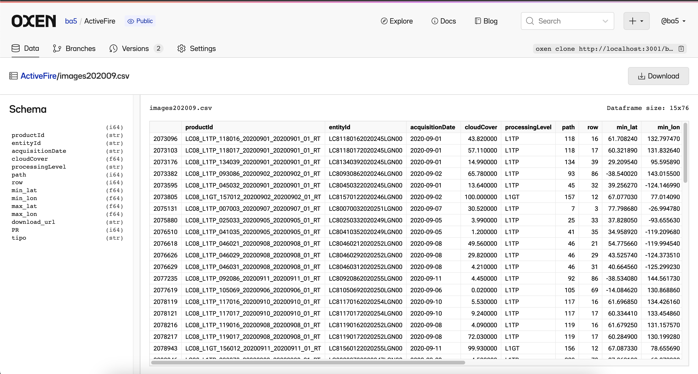
Already, we're getting a lot more information about the structures and datatypes of the dataset, while adding a version-controlled history we can turn to if we make any mistakes along the way. 

Diving a bit further into the images202009 file...
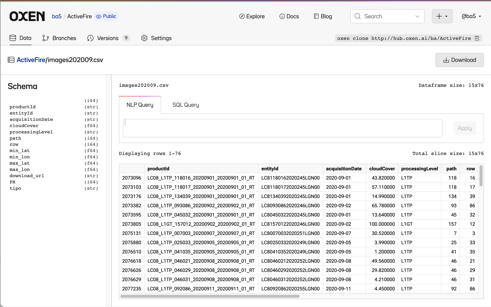
...OxenHub gives us no-fuss insight into the shape and schema of the dataset, and the ability to explore it further to understand what it represents. 

The `productId` column ("LC08") and `cloudCover` tipped us off that this is a metadata export of full 5600x6100 pixel LANDSAT scenes from which the researchers exported their 256x256 pixel patches for modeling. 

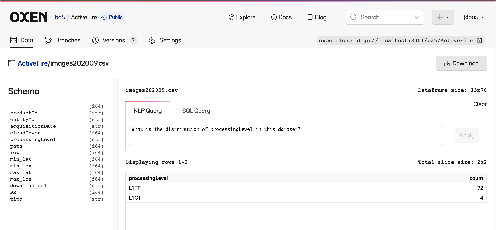

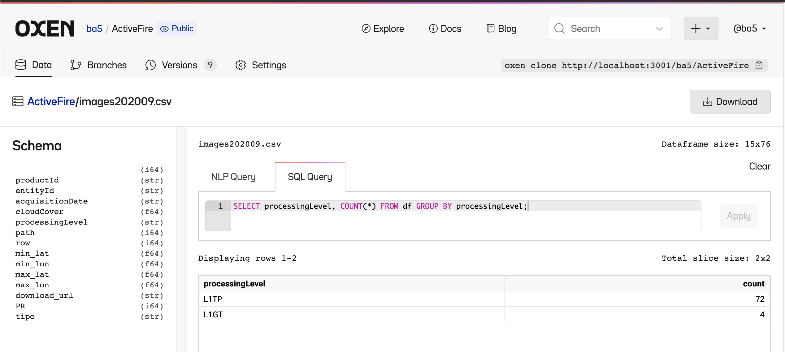

We can use the natural language query interface to translate our analytic questions into SQL to reach a better understanding of which terrain correction methods are present in the dataset. The imbalance here between Precision and Terrain Correction (L1TP) and Systematic Terrain Correction (L1GT) is important to flag for our team during model and data development, as they could cause inconsistencies in the resulting data or confusion in the model training process.

**Unpacking and restructuring**
Now that the Google Drive downloads have unzipped, we can `oxen add`, `oxen commit`, and then `oxen push` them to our repository, first in their original format...
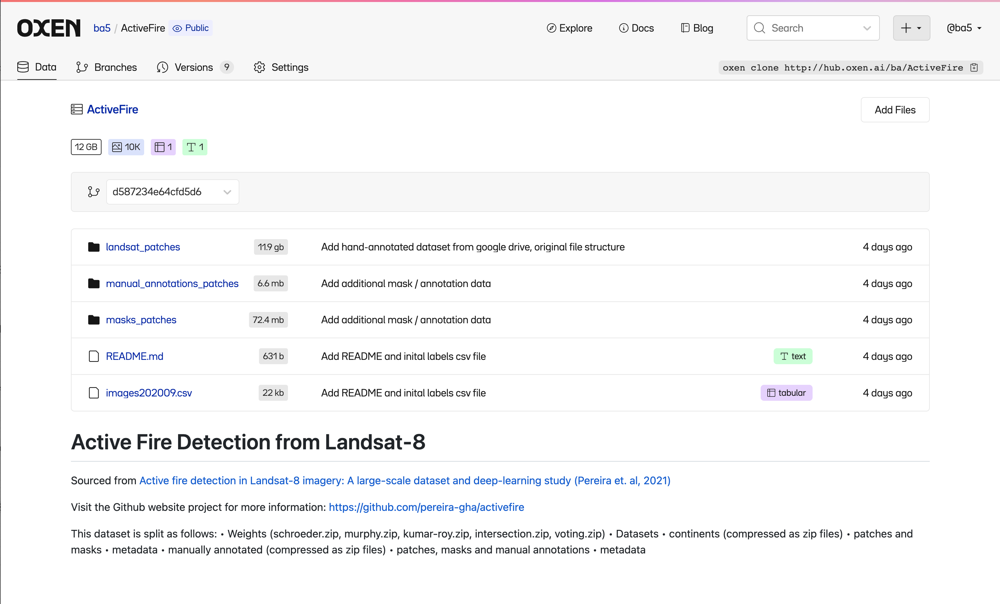
...then, after a bit of friction, in a reorganized format that will set us up for clearer delineation and linkage between our data and labels: 

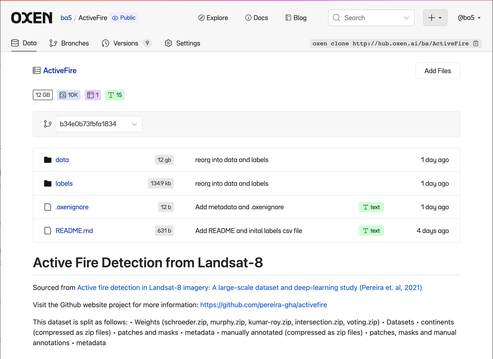


#### 2. Improving data-label linking and training ergonomics 
In the source dataset, the original satellite image for a patch, the authors' manually annotated labels, and the 5 sets of algorithmically determined labels are linked together only implicitly through commonalities in the filenames:

```
Input data (LANDSAT) path: 
- LC08_L1GT_226074_20200921_20200921_01_RT_p00811

Manual annotation path: 
- LC08_L1GT_226074_20200921_20200921_01_RT_v1_p00811

Kumar-Roy: 
- LC08_L1GT_226074_20200921_20200921_01_RT_Kumar-Roy_p00811

Murphy: 
- LC08_L1GT_226074_20200921_20200921_01_RT_Murphy_p00811

Intersection:
- LC08_L1GT_226074_20200921_20200921_01_RT_Intersection_p00811


```

While this isn't particularly difficult to parse with regular expressions at training or inference time, it's also an opportune hiding spot for sneaky human error and unnecessary data munging overhead on each of the individual engineers working on this project. 

Further, while there are 9,044 total patches of raw imagery included in this dataset, the various annotation types vary in number and don't cover the same data: 
- Manual annotations: 100
- Kumar method: 391
- Murphy method: 164
- Schroeder method: 227
- Intersection method: 118
- Voting method: 198

...so solidifying awareness of coverage across the various labeling types in one place is key to effective collaboration on this dataset. 

**Creating a data -> label mapping file and validating with OxenHub**

We parsed the filenames to the common patch_id, creating the following mapping file structure...


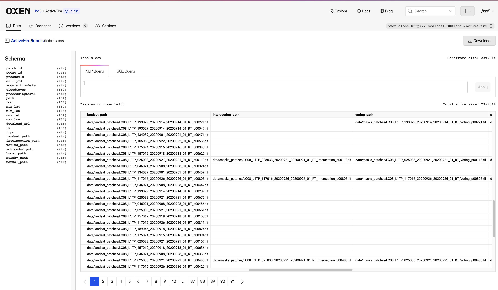
...associating each LANDSAT patch to the various label paths for that patch, when they exist. 

We can use schema metadata to let OxenHub know which columns are relative filepaths:

```
TODO: Schema setting from CLI
```

which quickly elucidates an error in our processing. 

**TODO IMAGE OF FAILED FILE EXISTENCE CHECK IN HUB**

After hunting down the bug in our filepath processing code, we make a new commit with the fix and are ready to train! 

**TODO IMAGE OF SUCCESSFUL FILE EXISTENCE CHECKS IN HUB**

This single source of truth for relating files across our repository will enable our team to more confidently investigate, sample, and evaluate on this dataset without having to worry about the integrity of the data-label linkage.

### And we're off!
With these reorganizations, validations, and improvements, this dataset is now much more readily usable for collaborative model development for wildfire detection and segmentation applications. 

We'd love to see what kind of models you're building on top of it! Clone the repo [here](https://www.oxen.ai/ba/ActiveFire), reach out at [hello@oxen.ai](mailto:hello@oxen.ai), follow us on Twitter [@oxendrove](https://twitter.com/oxendrove?ref=blog.oxen.ai), dive deeper into the [documentation](https://github.com/Oxen-AI/oxen-release?ref=blog.oxen.ai), or **Sign up for Oxen today. [http://oxen.ai/register.](http://oxen.ai/register.?ref=blog.oxen.ai)**

And remember—for every star on [GitHub](https://github.com/Oxen-AI/oxen-release?ref=blog.oxen.ai), an ox gets its wings.

No, really...we hooked up an [Oxen repo](https://oxen.ai/ox/FlyingOxen?ref=blog.oxen.ai) to a GitHub web-hook that runs Stable Diffusion every time we get a star. [Go find yours!](https://oxen.ai/ox/FlyingOxen?ref=blog.oxen.ai)


