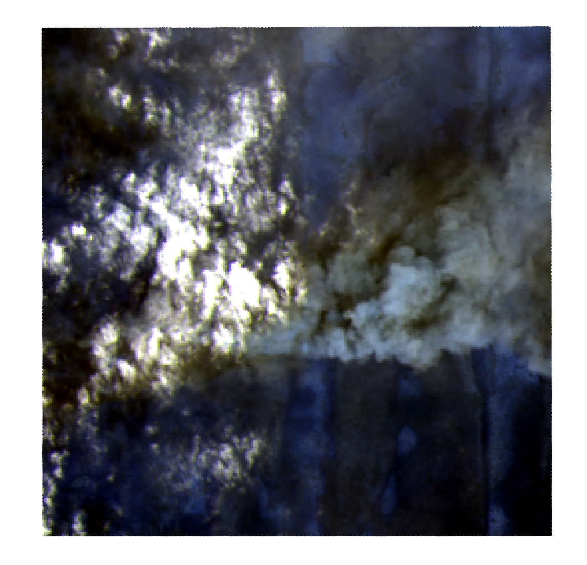
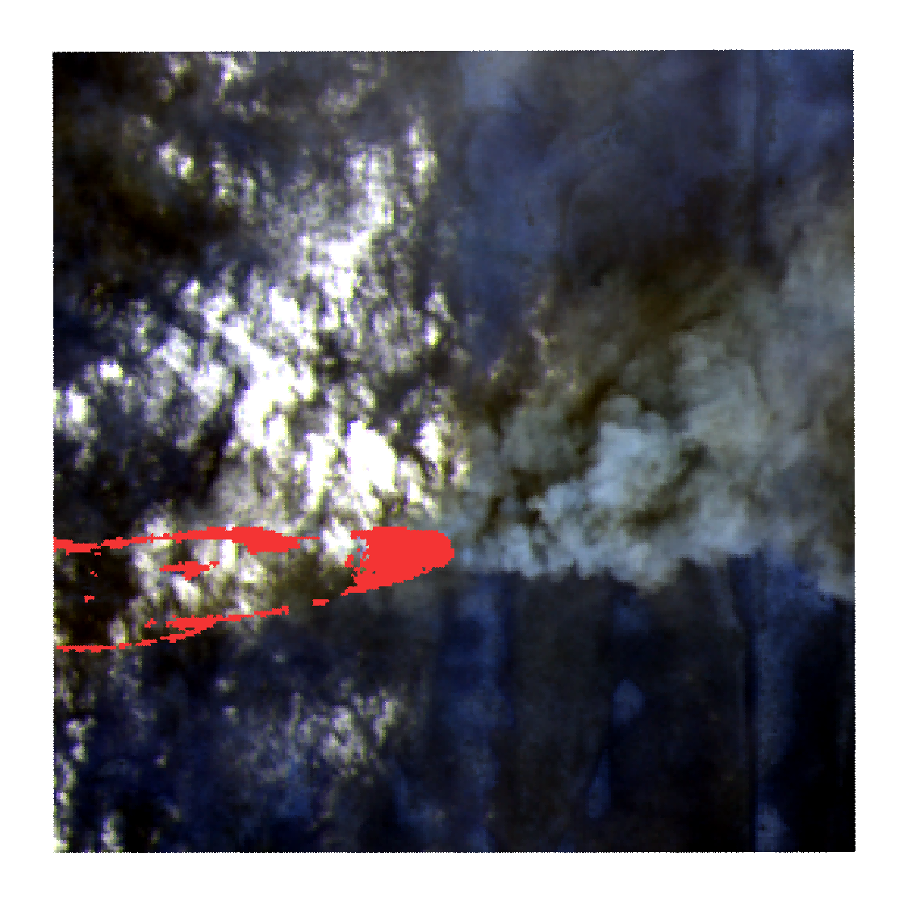
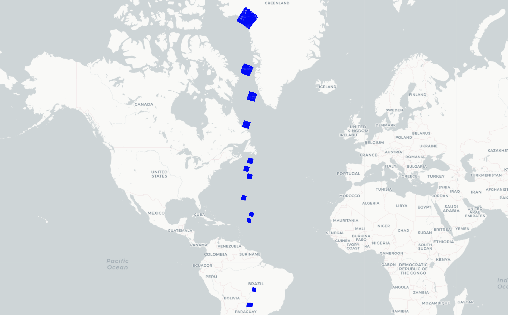
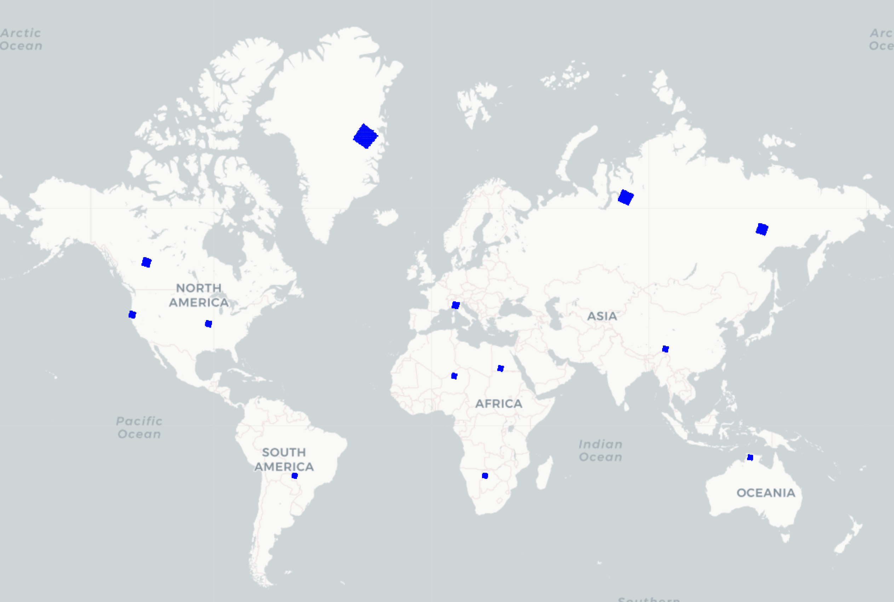
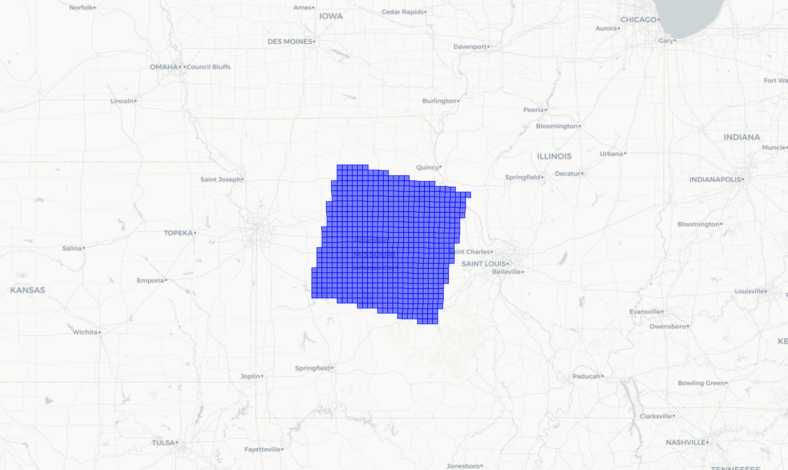

# Preparing Satellite Data for Wildfire Detection with Oxen.ai 🔥🛰️
### Introduction
There are few domains with a greater quantity of high-quality, publicly accessible data than Earth-observing satellite imagery. Government-funded missions such as  [LANDSAT](https://www.usgs.gov/landsat-missions#:~:text=Since%201972%2C%20Landsat%20satellites%20have,natural%20resources%20and%20the%20environment.) (USGS / NASA) and [SENTINEL](https://sentinel.esa.int/web/sentinel/missions/sentinel-2) (ESA) have captured and transmitted terabytes of this data every day for multiple decades, providing an extremely rich resource to those wishing to develop models for pressing geospatial challenges like disaster response. 

Researchers have built and meticulously annotated domain-specific datasets from this vast array of satellite imagery, such as [this dataset](https://drive.google.com/drive/folders/1GIcAev09Ye4hXsSu0Cjo5a6BfL3DpSBm) for space-based active fire detection introduced in [this paper by Pereira et. al](https://arxiv.org/abs/2101.03409).

While these datasets are information-rich and freely available, they are notoriously difficult to collaborate on for machine learning applications due to a few key factors:

##### 1: **Size**
The SENTINEL-2 and LANDSAT-8 constellations capture imagery of the full global landmass (>57 million mi^2) every 5 and 16 days respectively. That's an enormous amount of data even with regular 3-channel RGB imagery—but these sensors also record outside the visible spectrum, meaning that each image has >10 channels and is as such >3x more storage-intensive than an RGB image of the same pixel dimensions. 

##### 2: Associating data with labels, space, and time
Satellite images have two extremely crucial pieces of metadata that cannot be ignored during model development: 
- Where was this image taken? 
- At what time was this image taken? 

This data is obtained partially through metadata attached to the image files and partially through separate resources issued by the satellite providers, meaning it's often difficult to identify and communicate a single source of truth as a team. 

##### 3: Data quality
Satellites can't see through clouds! They're also susceptible to having compromised portions due to interference, sun glint, and other unavoidable error sources generated by the curvature and rotation of the earth. 

Taken together, these features should give insight into why model development on satellite data requires active, granular, version-controlled curation of datasets to produce optimal outcomes. 

## Where we're going 
In this tutorial, we'll transform a widely-cited dataset for wildfires detection from a 10GB Google Drive-hosted .zip file to a cloneable, well-organized [Oxen.ai](www.oxen.ai) data repository ready for model development.

## The Dataset 
We'll be walking through how to prepare [this excellent dataset](https://drive.google.com/drive/folders/1GIcAev09Ye4hXsSu0Cjo5a6BfL3DpSBm) (introduced in [this paper by Pereira et. al](https://arxiv.org/abs/2101.03409)) for space-based active fire detection.

This dataset contains patches of imagery extracted from LANDSAT-8 satellite imagery across Earth, many of which contain portions of actively burning wildfires. 

While the authors processed the full 1.6TB of imagery captured by LANDSAT-8 in August 2020 (targeting peak fire season), we're primarily interested in the excellent subset of data for which they manually created segmentation masks denoting active burn. 


In addition to being a more manageable (12GB) dataset size for model fine-tuning and evaluation applications, these human-verified labels will give any downstream models the best possible signal with which to learn to detect fires in novel imagery.

 



In addition to these ground-truth manual annotations, the researchers include 5 similar computationally generated segmentation masks taken from best-practice formulas across the remote sensing literature. These leverage various properties of the pixel values of various spectral channels in the imagery to determine likely fire zones. While less precise and validated than the manual annotations, these can also be a useful reference point for model validation.

**Data access pre-Oxen**
The authors use a [GitHub repository](https://github.com/pereira-gha/activefire/tree/main) to distribute the dataset, but the only data currently hosted there are a 77-row metadata file called `images2020009.csv` (we'll come back to this shortly) and some download scripts to fetch the full dataset from .zip files Google Drive.


### From .zip file to collaboration with Oxen 🐂📈
We see three main areas in which we can better ready this dataset for collaborative model development. 

**1. Enable atomic changes.** If we want to add, modify, or remove 50 MB of data from this dataset, we should only have to push (and our colleagues subsequently pull) 50 MB — not the whole 10 GB zip file. 

If we identify a mistake and want to roll these changes back, we shouldn't have to hunt for the `DATA_VERSION_3_FINAL.zip` taking up extra storage on our drive - instead, we'll leverage Oxen's version control to seamlessly undo the change. 

**2. Improve data-label linking.** The source data and 6 human + computed label sets are currently linked somewhat tenuously through pattern matching in the image file paths. We'll nail this down to an authoritative, well-validated data -> labels mapping file to save our teammates some meticulous ETL work and speed up the model development process. 

**3. Improve geographic awareness.** We'll extract the area of the earth where each one of these image patches was taken and associate it directly with the image record to help our team maintain better awareness of global dataset coverage and avoid the pitfalls of improper spatial sampling.

### Making the data modeling-ready with Oxen

#### 1. **Enabling atomic, versioned dataset collaboration**
We want to enable our team to efficiently iterate on this data throughout the duration of the wildfire detection project. In this dataset's original distribution via a collection of .zip files hosted on Google Drive, any changes, however small, to the source data would require a recompression and re-upload of the 10GB data folder.


Integration of these changes by other team members would then require a re-download of the full dataset and manual merging with their local work, without any built-in awareness of the changes made between versions.

Instead, we can unpack this data into an Oxen repository so that all our teammates can easily: 
- Examine, query and explore the data in the OxenHub UI
- Clone it locally with `oxen clone https://www.hub.oxen.ai/ba/ActiveFire`
- Create a space-saving local working copy with `oxen checkout -b my-local-branch`
- Contribute to the improvement of the repo through adding, deleting, and modifying additional files without needing to re-package and re-push all 10GB of data. 
- TODO: remote staging? or too much?

**Early exploration and understanding**

While waiting for the .zip files to download and unpack from the Google Drive source, we created a README referencing back to the original project.

Included with the data was a tabular file titled `images202009.csv`—we couldn't quite tell what this file represented at first, so we pushed it up to Oxen as well to explore further. 


Already, we're getting a lot more information about the structures and datatypes of the dataset, while adding a version-controlled history we can turn to if we make any mistakes along the way. 

Diving a bit further into the images202009 file...

...OxenHub gives us no-fuss insight into the shape and schema of the dataset, and the ability to explore it further to understand what it represents. 

The `productId` column ("LC08") and `cloudCover` tipped us off that this is a metadata export of full 5600x6100 pixel LANDSAT scenes from which the researchers exported their 256x256 pixel patches for modeling. 


We can use the natural language query interface to translate our analytic questions into SQL to reach a better understanding of which terrain correction methods are present in the dataset. The imbalance here between Precision and Terrain Correction (L1TP) and Systematic Terrain Correction (L1GT) is important to flag for our team during model and data development, as they could cause inconsistencies in the resulting data or confusion in the model training process.

**Unpacking and restructuring**
Now that the Google Drive downloads have unzipped, we can `oxen add`, `oxen commit`, and then `oxen push` them to our repository, first in their original format...

...then, after a bit of friction, in a reorganized format that will set us up for clearer delineation and linkage between our data and labels: 


#### 2. Improving data-label linking and training ergonomics 
In the source dataset, the original satellite image for a patch, the authors' manually annotated labels, and the 5 sets of algorithmically determined labels are linked together only implicitly through commonalities in the filenames:

```
Input data (LANDSAT) path: 
- LC08_L1GT_226074_20200921_20200921_01_RT_p00811

Manual annotation path: 
- LC08_L1GT_226074_20200921_20200921_01_RT_v1_p00811

Kumar-Roy: 
- LC08_L1GT_226074_20200921_20200921_01_RT_Kumar-Roy_p00811

Murphy: 
- LC08_L1GT_226074_20200921_20200921_01_RT_Murphy_p00811

Intersection:
- LC08_L1GT_226074_20200921_20200921_01_RT_Intersection_p00811


```

While this isn't particularly difficult to parse with regular expressions at training or inference time, it's also an opportune hiding spot for sneaky human error and unnecessary data munging overhead on each of the individual engineers working on this project. 

Further, while there are 9,044 total patches of raw imagery included in this dataset, the various annotation types vary in number and don't cover the same data: 
- Manual annotations: 100
- Kumar method: 391
- Murphy method: 164
- Schroeder method: 227
- Intersection method: 118
- Voting method: 198

...so solidifying awareness of coverage across the various labeling types in one place is key to effective collaboration on this dataset. 

**Creating a data -> label mapping file and validating with OxenHub**

We parsed the filenames to the common patch_id, creating the following mapping file structure...


...associating each LANDSAT patch to the various label paths for that patch, when they exist. 

We can use schema metadata to let OxenHub know which columns are relative filepaths:

```
TODO: Schema setting
```

which quickly elucidates an error in our processing. 

**TODO IMAGE OF FAILED FILE EXISTENCE CHECK IN HUB**

After hunting down the bug in our filepath processing code, we make a new commit with the fix and are ready to train! 

**TODO IMAGE OF SUCCESSFUL FILE EXISTENCE CHECKS IN HUB**

#### 3. Improving Geographic Awareness 
##### Why emphasize geography?
In any machine learning application, it's crucial to have a rigid separation between the data the model uses to learn (the training data) and the data we use to evaluate the accuracy of its predictions (the validation / testing data). 

Violating this principle by training on some of the validation data (referred to as **data leakage**) can reward the model for "memorizing" its training data without learning the true underlying capability for which it is trained (wildfire detection, sentiment classification, etc.). This "cheating" on the evaluation benchmark can give the model evaluators false confidence in the model's ability to make accurate predictions when deployed in the real world. 

This separation is typically created by randomly separating the data into training and testing sets, and this methodology is usually sufficient for non-geographical applications. 

When training models on satellite imagery, however, there is a subtler form of data leakage that can derail model evaluation even under a standard train-test data split. It's called **spatial autocorrelation**, and it happens whenever a model is evaluated on images that are very geographically close to one or more samples in its training data. 

In more intuitive terms, **parts of the earth tend to look very similar to places very near to them due to commonalities in terrain, vegetation, seasonality, and the built environment**. When not properly accounted for, powerful AI models can capitalize on these similarities and "memorize" them rather than focusing on the primary task at hand, such as identifying burning areas.

The remedy for this is using **spatially stratified sampling** rather than the traditional random sampling in training/test set design. For accurate performance estimates, teams should ensure that the test samples are not too closely colocated with any training samples — but for this, they need convenient, consistent awareness of the geographic location of the samples in the dataset. 

##### Persisting image geodata in Oxen
**TODO:** how can we more explicitly tie this to oxen - geo renderer?

The image patches are stored in GeoTIFF (.tif) format, meaning they contain additional baked-in metadata about what exact location on earth the image covers. 

This step is _highly_ error-prone, however, as these geographical positions are encoded in dozens of different "projections," or ways of creating a 2D coordinate system from the 3D structure of the Earth.

Mishandling these projections is extremely easy to do—small, silent mistakes in the reprojection process can significantly compromise the geographic understanding of your dataset. Look no further than our team's first attempt at this step — which led us to discover the unique (and obviously errant) phenomenon of wildfires occurring in the waters of the Atlantic.



Some quick debugging, another version quickly committed to Oxen, and we've got our team back on track: 



It's clear that these tightly clustered bunches of images within a few common locations are at major risk for spatial autocorrelation bias if sampled randomly. By embedding awareness of image locations within the data / labels mapping file, we can empower our team to sample in accordance with best practices—in this case, ensuring that these bunches of images are kept together in different folds of the training / validation data.



### And we're off!
With these reorganizations, validations, and improvements, this dataset is now much more readily usable for collaborative model development for wildfire detection and segmentation applications. 

We'd love to see what kind of models you're building on top of it! Clone the repo [here](https://www.oxen.ai/ba/ActiveFire), reach out at [hello@oxen.ai](mailto:hello@oxen.ai), follow us on Twitter [@oxendrove](https://twitter.com/oxendrove?ref=blog.oxen.ai), dive deeper into the [documentation](https://github.com/Oxen-AI/oxen-release?ref=blog.oxen.ai), or **Sign up for Oxen today. [http://oxen.ai/register.](http://oxen.ai/register.?ref=blog.oxen.ai)**

And remember—for every star on [GitHub](https://github.com/Oxen-AI/oxen-release?ref=blog.oxen.ai), an ox gets its wings.

No, really...we hooked up an [Oxen repo](https://oxen.ai/ox/FlyingOxen?ref=blog.oxen.ai) to a GitHub web-hook that runs Stable Diffusion every time we get a star. [Go find yours!](https://oxen.ai/ox/FlyingOxen?ref=blog.oxen.ai)


