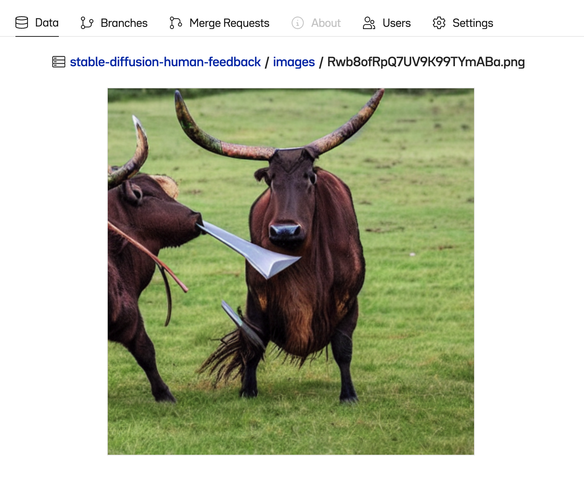

# Collecting Data from Human Feedback for Generative AI

### Introduction
Human feedback is essential to the accuracy and continual improvement of generative AI systems. [Incorporating human ranking of alternative model outputs](https://arxiv.org/abs/2009.01325) into model reward functions is a key feature of the training protocols for ChatGPT and other large language models. It has also recently [shown significant promise in improving the alignment and prompt relevance of image generation systems.](https://arxiv.org/abs/2302.12192)


Here's a sneak peek of the human feedback collection UI we'll be building in this walkthrough:


At [Oxen](https://oxen.ai), we’ve built a data version control system that makes collecting and using this human feedback data easier than ever before. In this tutorial, we’ll build a simple web application to allow seamless collection of preference data in response to images generated by a Stable Diffusion model. We’ll enables users to generate four candidate images based on a user-created prompted, then stream their “votes” on the resulting image candidates to an Oxen repository for later analysis and model fine-tuning.


Let’s dive in! 🏄‍♂️

## Tools

Here are the key pieces of software we’ll need to put this puzzle together.

- [`oxen`](https://www.oxen.ai) for seamless behind-the-scenes data collection and versioning
- [`gradio`](https://gradio.app) for building a simple data labeling UI solely in Python
- [`huggingface`](https://huggingface.co) + [`torch`](https://pytorch.org/get-started/locally/) for generating our candidate images with Stable Diffusion
- [Lambda labs instance](https://lambdalabs.com/) for cost-effective, easy-to-configure GPU compute. We used Lambda's 1xA10 instance for this tutorial, which costs $0.60/hr at time of writing and ran one 4-image inference step in ~30 seconds.

## Setting up the UI

We’ll start by laying out the Gradio components needed to evaluate the model, wire them together, and ensure they work on mock data before looping in our Stable Diffusion image generator.

The full code for this tutorial is available [here](https://github.com/Oxen-AI/examples/tree/main/examples/automated_human_feedback_collection/code).

```python
import gradio as gr
```

> Due to the number of moving parts in this use case, we’ll need Gradio’s lower-level `Blocks` API, the documentation for which is found [here](https://gradio.app/docs/#blocks).
> 
> Throughout the steps below, you can start your app in hot-reload mode by running `gradio app.py` in the terminal.

### Prompt entry: text box and button

This is where the user will enter their desired prompt, which we’ll later pass to our Stable Diffusion model to condition the image generation process.

```python
with gr.Blocks() as demo: 
	prompt = gr.components.Textbox(label="Enter Prompt")
	generate = gr.Button("Generate candidate images")
```


### Image rendering and user voting

We need four image panels, four upvote buttons, and four downvote buttons, which will all be styled and manipulated in the same manner. To avoid repeating ourselves, we can render them iteratively and store them in a `dict` (or `list`) as below.

We’ll also contain them in a `Row` to display them horizontally.

```python
images = {}
upvote_buttons = {}
downvote_buttons = {}
# with gr.Blocks() as demo...
	for i in range(1, 5):
		with gr.Column():
			images[i] = gr.components.Image(label=f"Candidate Image {i}", type="pil").style(full_width=False)
			with gr.Row():
				upvote_buttons[i] = gr.Button(value="👍")
        downvote_buttons[i] = gr.Button(value="👎")
```


We’ve now got our core static interface elements in place—let’s connect the dots and start rendering some mock data!

### Adding Interactivity
We need two event handlers: one for rendering our generated images on click, and another for writing to an oxen repo when a user submits an upvote or downvote.

```python
def generate_images(prompt):
	dummy_img = PIL.Image.open("a-dummy-image")
	return [dummy_img]*4

def save_image_to_repo(img_prompt, img, button):
	print(f"Applying {button} rating to image {img} with prompt {img_prompt}")
	
# Add event handlers
# with gr.Blocks() as demo:
# ...
generate.click(generate_images, inputs=prompt, outputs=list(images.values())

for i in range(len(1,5)):
	upvote_buttons[i].click(save_image_to_repo, inputs=[prompt, images[i], upvote_buttons[i]])
	downvote_buttons[i].click(save_image_to_repo, inputs=[prompt, images[i], downvote_buttons[i]]) 
```

For the handler on `generate`: pass one input, the text prompt, and expect four images as output, passing each one to one of the four `gr.components.Image` blocks in our layout.

For the `upvote_buttons` and `downvote_buttons`, call `save_image_to_repo`, we're passing in in:

- `prompt` - for saving to oxen as training data
- `images[i]` - the image that triggered the button click
- `upvote_buttons[i]` - the value of the button itself, so we can tell if it was a 👍 or 👎 when saving this data in oxen.

The dummy images now render after clicking the generate button, and the image data is being correctly routed on upvote / downvote.


Onward to generating some real images!

### Generating images with Stable Diffusion

This step requires huggingface’s `diffusers` and `transformers` libraries, but is otherwise straightforward. We’ll use the `StableDiffusionPipeline` class to generate four images from a given prompt, then return them to the UI via our `generate_images` handler.

```python
from diffusers import StableDiffusionPipeline

# Set up pipeline for use in our generate_images fn
pipe = StableDiffusionPipeline.from_pretrained("CompVis/stable-diffusion-v1-4")

# Use GPU for inference
pipe.to("cuda")

# Update generate_images to run an inference step and return 4 images
def generate_images(prompt):
	images = pipe(prompt, num_images_per_prompt=4).images
  return images
```

…and that’s all it takes! Test it out by generating an image from any prompt you can think of, noting that this might take some time depending on your machine’s GPU specs. Our Lambda Labs instance (specs listed earlier) took ~15 seconds to generate four images.

You can check its progress through 50 inference steps in the terminal where your `gradio` app is running.

### Collecting human feedback data with Oxen

We’ll start by creating a repo on OxenHub that will store our image data and human ratings, using the following structure:

```python
[repo-name]
	- images
		- 0001.png
		- 0002.png
		- # etc. 
	- train.csv
```

Where `train.csv` includes columns for the `prompt`, `path` to the image, and `rating` assigned by the user in our gradio app. See an example [here](https://www.oxen.ai/ba/stable-diffusion-human-feedback).

After creating this repo, we can set up our python script to allow us to remotely make commits to it!

**Authenticating with oxen**

1. Create an account at [oxen.ai](http://oxen.ai)
2. Create a repo to store your human feedback data:

2. Obtain your Oxen API key from your Profile tab at [oxen.ai](http://oxen.ai)

3. If it doesn’t already exist, create a `.oxen` directory in your home directory
4. Then, in a notebook or interactive python shell, run the following:

```python
# Only needs to be run once - no need to include in app 
import oxen
oxen.auth.create_user_config(name="your name", email="your-email@email.you")
oxen.auth.add_host_auth(host="hub.oxen.ai", token=YOUR_TOKEN)
```

This will enable you to remotely commit from python to any repos where you have push permissions.

**Writing to the repo**

Configure the RemoteRepo object as as follows for easy contribution without needing to clone the repo locally:

```python
from oxen import RemoteRepo
repo = RemoteRepo("your-namespace/your-repo-name") # ba/stable-diffusion-human-feedback
repo.checkout("branch-name", create=True) # For new branch
IMAGE_FOLDER = "images"
```

Then adapt the `save_image_to_repo` handler to remotely add the data to both the `images` folder and the `train.csv` dataframe on each button click.

```python
def get_rating(label):
	# Helper to get plaintext rating from clicked button
  if label == '👍':
      return 'good'
  elif label == '👎':
      return 'bad'
  else:
      raise ValueError(f"Unexpected rating label: {label}")

def save_image_to_repo(img_prompt, img, button):
	# Randomize to avoid collisions 
	filename = f"{shortuuid.uuid()}.png"
	# Temporarily save image to disk
	img.save(filename)
    # Create new row to be added to df 
	row = {"prompt": img_prompt, "path": f"{IMAGE_DEST}/{filename}", "rating": get_rating(button)}
	
	# Remotely stage files to repo 
	try:  
    	repo.add(filename, IMAGE_DEST)
    	repo.add_df_row("train.csv",  row)
    	repo.commit(f"Add from RLHF: {img_prompt}")
  	except Exception as e:
		# Unstage changes if any part of add-commit flow was unsuccessful
		repo.remove(filename)
		repo.restore_df("train.csv")
		# Clean up temp file
   	os.remove(filename)
```

### Test it out!

All upvotes and downvotes will be near-instantly added to the `images` folder and `train.csv` files in your target repo as individual commits. This facilitates easy, versioned creation of fine-tuning data to help hone your Stable Diffusion model.





## Thanks for reading!

At OxenAI we want to see what you are building! Reach out at [hello@oxen.ai](mailto:hello@oxen.ai), follow us on Twitter [@oxendrove](https://twitter.com/oxendrove), dive deeper into the [documentation](https://github.com/Oxen-AI/oxen-release), or [**Sign up for Oxen today.**](http://oxen.ai/register)

And remember—for every star on [GitHub](https://github.com/Oxen-AI/oxen-release), [an ox gets its wings.](https://www.oxen.ai/ox/flyingoxen)

