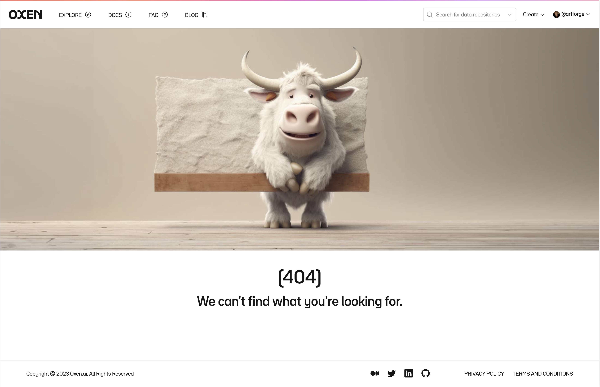
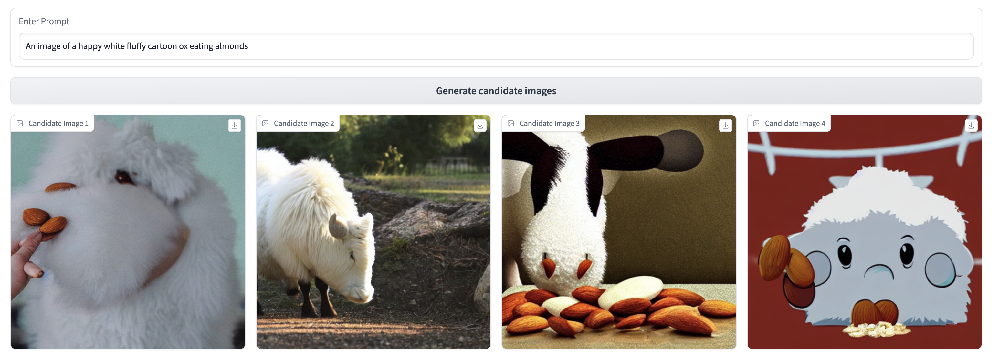
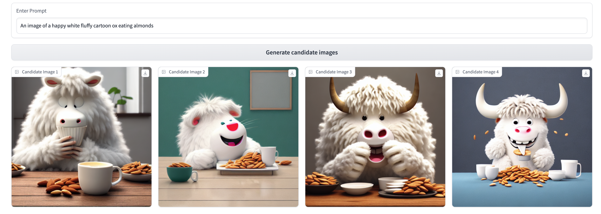
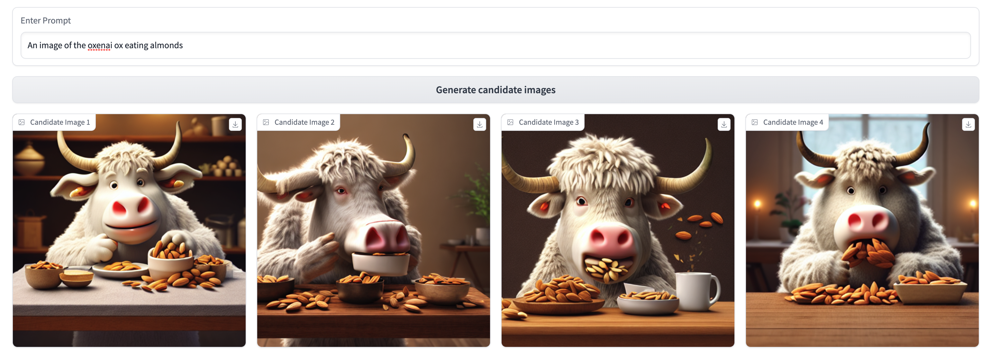
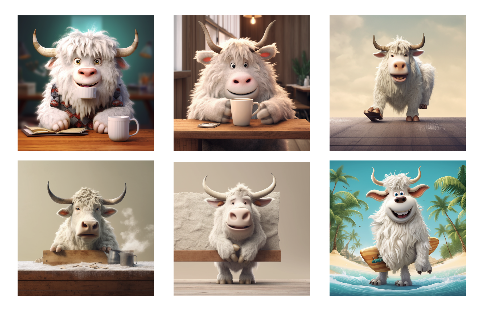
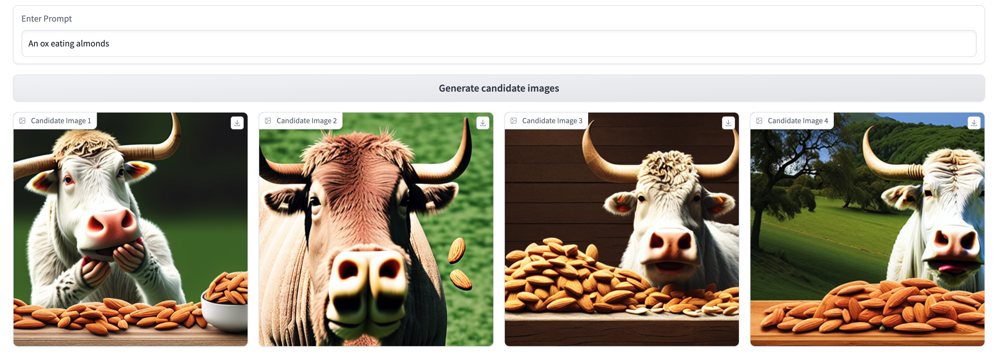
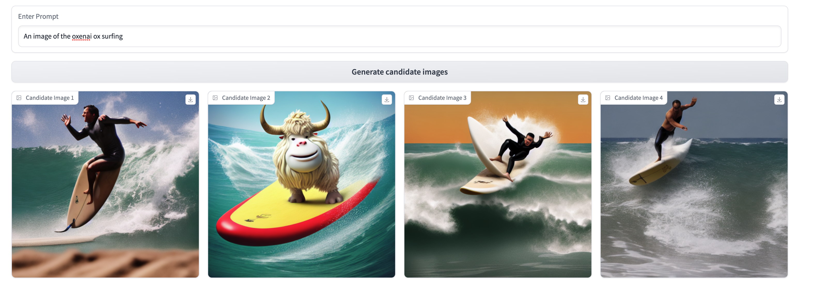
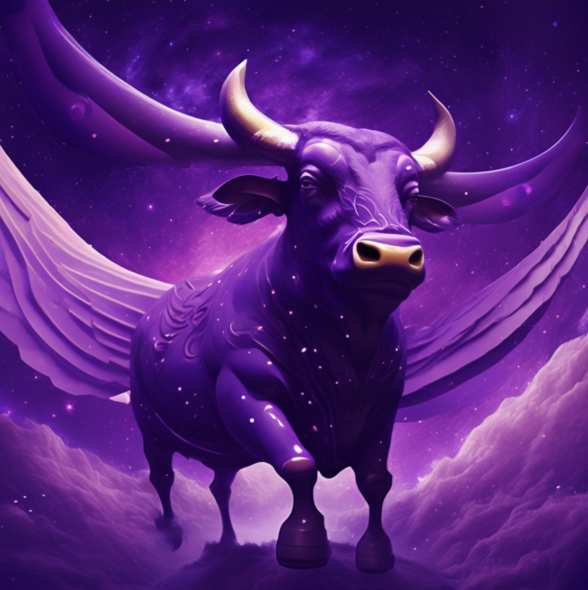

# Creating a Cute Custom Character with Stable Diffusion and Dreambooth

## Introduction
[Stable Diffusion](https://github.com/CompVis/stable-diffusion) is an incredible open-source tool for fast, effective generation of novel images across a wide variety of domains. Despite its power and convenience, it can struggle to create consistent, identifiable characters in specific styles.

While improvements in prompting can mitigate this to some extent, it is almost always a better bet to fine-tune the model with your own data. Here are a few reasons why: 

1. No amount of clever prompting can lead the neural network to generate things it hasn’t seen enough of in its training data. We’re pretty confident there wasn’t a preponderance of fluffy cartoon oxen in [Stable Diffusion’s training data](https://laion.ai/blog/laion-5b/), which leads to the lackluster baseline results we’ll show below. It’s much easier for us to provide this information to the model directly than to wait and hope that a future version of Stable Diffusion will somehow find and include precisely the data we’re looking for.
2. If you train or fine-tune open source models with your own data rather than remaining beholden to third-party services, you can embed the model directly into your application. This will likely save you money over purchasing credits to existing providers, and eliminate your dependency on a vendor that could change its API / pricing or stop operating at any time.
3. Fine-tuning with your own proprietary data allows you to gain a competitive advantage that you can’t access with prompting alone. If your IP relies solely on the specific way you prompt a publicly accessible model, it’s much easier for competitors to replicate your results!

At [Oxen](https://oxen.ai/), we’re firm believers in the power of enhancing foundational models with domain-specific data. In this tutorial, we’ll use an Oxen repository and the [Dreambooth](https://dreambooth.github.io/) fine-tuning technique to create a Stable Diffusion variant that can consistently reproduce cute, fluffy cartoon oxen like the one currently hanging out [on our 404 page](https://www.oxen.ai/not-a-real-url).



Here's a quick preview of the results we'll be able to achieve with only a few minutes of training on only six images.


**Before Dreambooth:**



**After Dreambooth:**



These are some pretty exciting results, both in the increased coherence and consistency of the generated images, and the ease with which we could teach the model to recognize "the oxenai ox" as a specific token. Let's get started!


## Software setup
This tutorial uses resources from [Hugging Face’s Dreambooth guide](https://huggingface.co/docs/diffusers/training/dreambooth), adapted for easier use with your own custom datasets via [Oxen](https://oxen.ai). The following contains all you’ll need to create your own Stable Diffusion character from scratch, but Hugging Face’s tutorial contains supplemental configuration details for anyone working with comparatively little GPU RAM. If you’re having trouble getting the model to train on your machine, check out [their walkthrough](https://huggingface.co/docs/diffusers/training/dreambooth) for tips!

### Install dependencies and boilerplate
We’ll use the `diffusers` package to fine-tune our model with Dreambooth. Clone its GitHub repo locally and install it, along with its dependencies.

```python
git clone https://github.com/huggingface/diffusers
pip install -U -r diffusers/examples/dreambooth/requirements.txt

cd diffusers
pip install -e .
```

Set up a default [Accelerate](https://github.com/huggingface/accelerate/) config for handle the boilerplate for running inference on GPUs:

```bash
# From a shell...
accelerate config default
```

```python
# ...or from a notebook
from accelerate.utils import write_basic_config 
write_basic_config()
```

### Getting our data from Oxen
Dreambooth’s strength lies in its ability to help a base model learn about a specific, named subject from only a few observations.

Instead of hundreds / thousands of prompt-labeled examples (i.e., “A cute cartoon ox riding a surfboard”) we can just specify a unique named identifier for all the training examples (we used ”an image of the oxenai ox” to teach the model about our mascot-to-be) and pass in just the imagery. 

As such, this example will use the ox images stored in [this Oxen repo](https://www.oxen.ai/ba/dreambooth-ox). With some help from ChatGPT in generating a wide variety of ox-related prompts, we’ve collected a few hundred generated ox images in our target style from a variety of models (read how to set up your own image generation RLHF system [here](https://blog.oxen.ai/collecting-data-from-human-feedback-for-generative-ai/)). Since Dreambooth works best with small but consistent datasets, we've selected the six oxen most consistent with our target style.



You can use any data you’d like here, but we’d recommend prioritizing quality and consistency over quantity to allow the model to learn as coherent a representation of your character as possible.

Once you've built an Oxen repo with your own data ([here's ours](https://www.oxen.ai/ba/dreambooth-ox) for reference), pull it down into your local environment:

```bash 
oxen clone https://www.oxen.ai/your-namespace/your-url-here
```
...well, that's all it takes. We're ready to train! 

## Training the model 
### Establishing a baseline 

Let’s first set up a way to view the results of both the base and fine-tuned models on similar prompts. `gradio` is a great tool to set up quick UIs for this exact purpose. 

The code for building this interface is available [here](https://github.com/Oxen-AI/examples/tree/main/examples/dreambooth_custom_character/code) and more extensively documented in our tutorial on [collecting human feedback data for generative AI](https://blog.oxen.ai/collecting-data-from-human-feedback-for-generative-ai/).

```bash
pip install gradio
```
```python

import torch
from diffusers import StableDiffusionPipeline
from PIL import Image 
import gradio as gr 

# Run inference with the base stable diffusion model 
pipe = StableDiffusionPipeline.from_pretrained("CompVis/stable-diffusion-v1-4")
pipe.to("cuda") # If using CUDA for GPU

def generate_images(prompt):
    images = pipe(prompt, guidance_scale=7.5, num_images_per_prompt=4).images
    return images 

with gr.Blocks() as demo: 
	prompt = gr.components.Textbox(label="Enter Prompt")
	generate = gr.Button("Generate candidate images") 
	images = {}
	with gr.Row()
		for i in range(1,5):
			with gr.Column():
				images[i] = gr.components.Image(label=f"Candidate Image {i}", type='pil')
	generate.click(generate_images, inputs=prompt, outputs=list(images.values()))

demo.launch(share=True)

```

This yields us the following UI, which we can use to generate some sample results for the base model (we used CompVis/stable-diffusion-v1-4, but feel free to experiment with others) across 3 prompting strategies. We’ll revisit these three prompts after our fine-tuning step to see what the model has learned!


### Fine-tuning with Dreambooth

The model training script we'll use is in the `diffusers` git repository we cloned earlier, at path `diffusers/examples/dreambooth/train_dreambooth.py`.

We’ll first set a few variables to correctly parameterize the script for our custom use case:

- `MODEL_NAME`: base model to start with from Hugging Face
- `INSTANCE_DIR`: directory containing our imagery for fine-tuning - will point to the `images` folder in our oxen repo
- `OUTPUT_DIR`: name of the model output folder (and the model name if uploading to Huggingface)
- `INSTANCE_PROMPT`: the unique “name” of the subject we want the model to learn

```bash
export MODEL_NAME = "CompVis/stable-diffusion-v1-4"
export INSTANCE_DIR = "./dreambooth-ox/images"
export OUTPUT_DIR = "stable-diffusion-oxified"
export INSTANCE_PROMPT = "an image of the oxenai ox"
```

We’re now set to run the script. All below flags use Hugging Face’s recommended settings. You’ll be directed by the CLI to authenticate with Hugging Face.

```bash
accelerate launch diffusers/examples/dreambooth/train_dreambooth.py \
  --pretrained_model_name_or_path=$MODEL_NAME  \
  --instance_data_dir=$INSTANCE_DIR \
  --output_dir=$OUTPUT_DIR \
  --instance_prompt="$INSTANCE_PROMPT" \
  --resolution=512 \
  --train_batch_size=1 \
  --gradient_accumulation_steps=1 \
  --learning_rate=5e-6 \
  --lr_scheduler="constant" \
  --lr_warmup_steps=0 \
  --max_train_steps=400 \
  --push_to_hub
```

This took around 5 minutes to run on a single NVIDIA A10 with 24GB of GPU VRAM, which we rented from [Lambda Labs](https://lambdalabs.com/).

### Generating new images 
If the `--push_to_hub` flag was set, the script will have pushed the resulting model up to Hugging Face after training. As such, we can modify our inference UI code as following to run inference on the new model: 

```python
# Run inference with the base stable diffusion model 
#OLD: pipe = StableDiffusionPipeline.from_pretrained("CompVis/stable-diffusion-v1-4")
#NEW: 
pipe = StableDiffusionPipeline.from_pretrained("<your-hf-username>/stable-diffusion-oxified")
```

### Results
Let’s compare the models using the same 3 prompts we applied pre-Dreambooth.





Lots of cool differences across these three prompting strategies to unpack here! Some key takeaways: 

1. The model has become shockingly good at producing new observations in our target ox style given how few training observations it has seen. This is the core competence of Dreambooth, and we're really impressed with how it turned out! 
2. As expected, the model is best at recalling our specific ox style when we use our training token, `an image of the oxenai ox`. In the third prompt, where we reference just `an ox`, the model’s underlying understanding of what an ox looks like from its original training data still shines through (though conditioned slightly by our examples—see the white fur and prominent horns). 
3. Even without explicit mention of the `oxenai ox` token, this fine-tuning has made the model more capable of producing cartoonish, fuzzy oxen—just look at the gap in coherence between the pre- and post-Dreambooth results for the first prompt!

### What’s next?

Though these early results are promising, the model still struggles a bit in domains dramatically different from the fine-tuning images.


Additionally, it’s nailed the general characteristics of our desired ox (cute, cartoonish, fuzzy) and is showing much-improved consistency, but isn’t yet able to produce a singular, recognizable character. 

As an attempt to solve both these issues, we’re going to use this new model (and an [Oxen-powered RLHF interface](https://blog.oxen.ai/collecting-data-from-human-feedback-for-generative-ai/)) to gain further, prompt-specific feedback for additional fine-tuning. We think that this will be key in bridging the gap to a generalizable, consistent character—stay tuned for the results! 

At OxenAI we want to see what you are building! Reach out at hello@oxen.ai, follow us on Twitter [@oxendrove](https://twitter.com/oxendrove), dive deeper into the [documentation](https://github.com/Oxen-AI/oxen-release), or **Sign up for Oxen today. http://oxen.ai/register.**

And remember—for every star on [GitHub](https://github.com/Oxen-AI/oxen-release), an ox gets its wings.

[No, really...go check it out!](https://oxen.ai/ox/FlyingOxen) 


