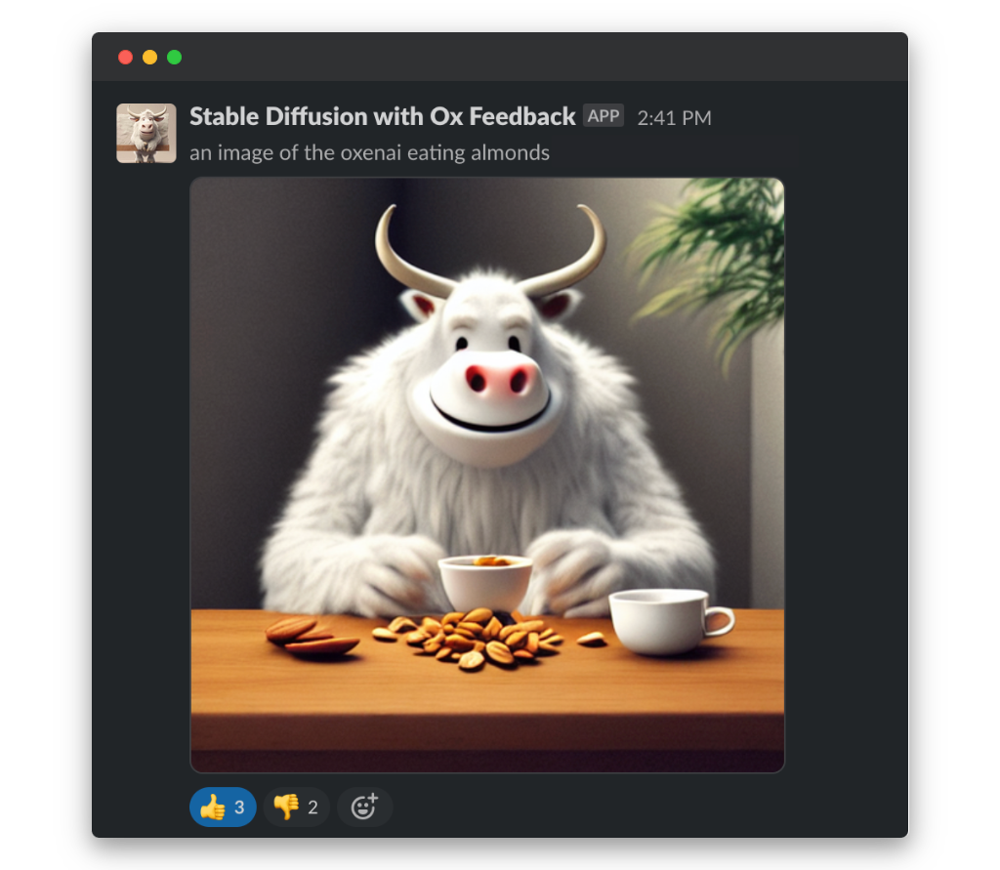
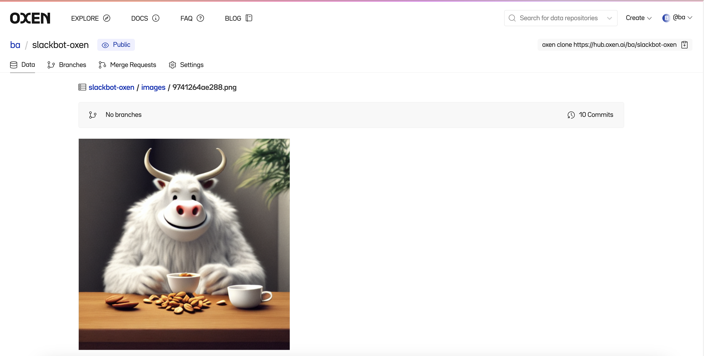
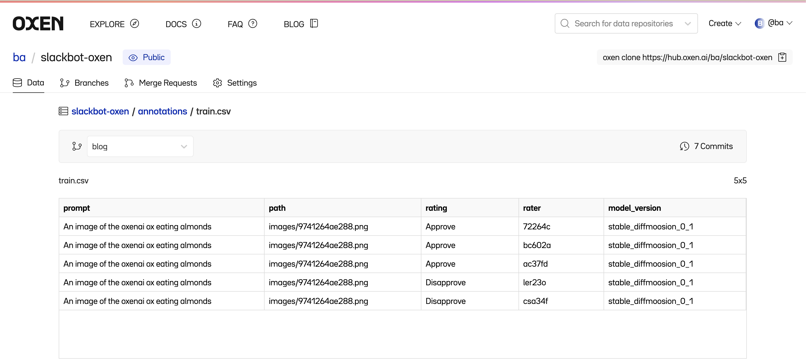
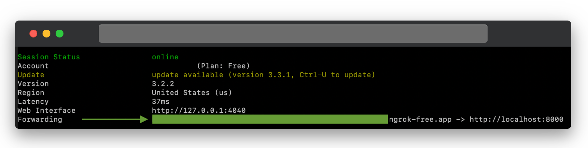
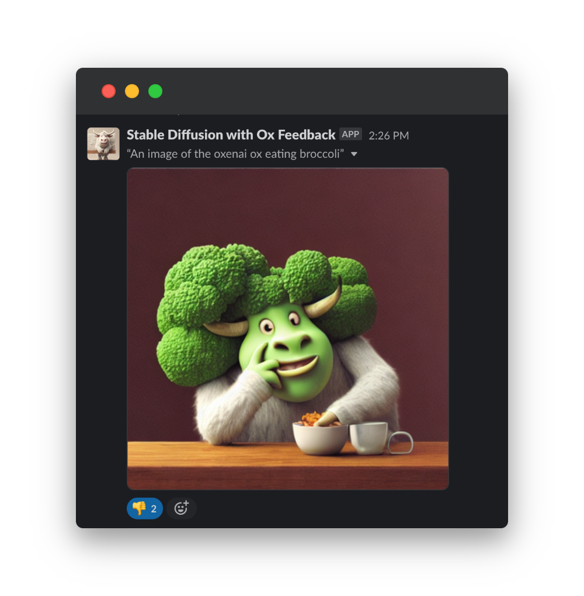
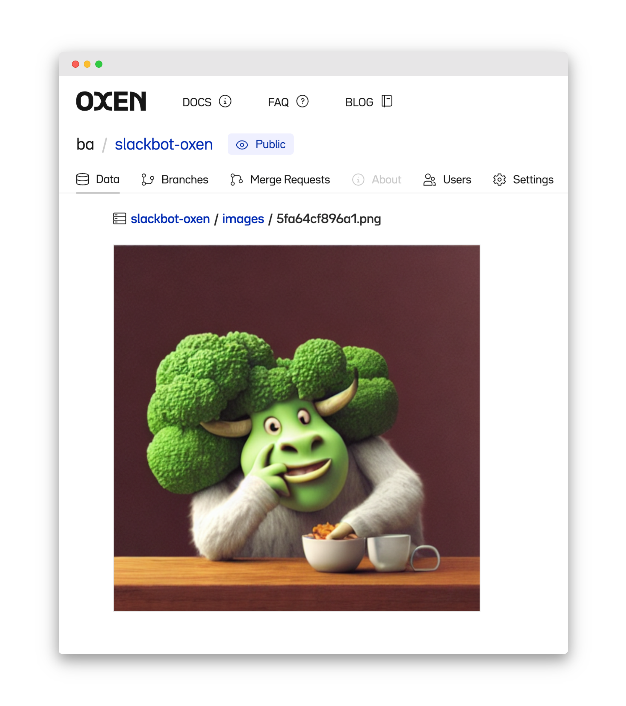
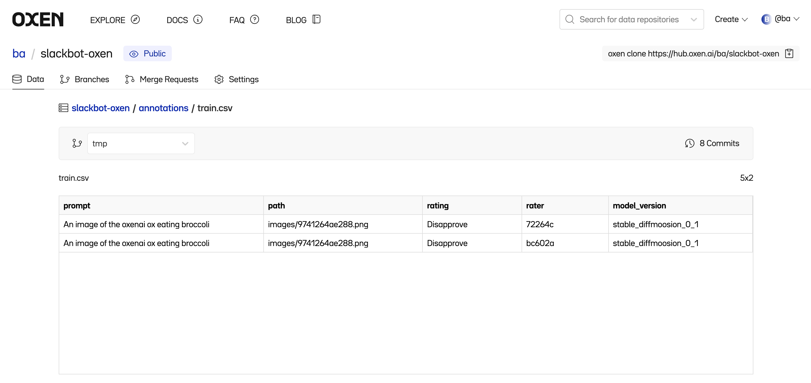

# Building a Slackbot-Driven RLHF Pipeline for Generative AI

## Introduction

Reinforcement Learning from Human Feedback (RLHF) is a powerful tool for improving the performance and alignment of generative models through the direct incorporation of human preferences into model reward functions. While its benefits for both [language modeling](https://arxiv.org/abs/2009.01325) and [image generation](https://arxiv.org/pdf/2302.12192.pdf) applications are well-documented, the pathways to the actual collection of this human evaluation data are often difficult and unclear.

At Oxen, we provide a suite of dataset version control tooling that makes this data collection process fast, secure, and infinitely integrable with platforms your team and users already love. 

In this tutorial, we’ll build an image generation Slackbot that will automatically collect our team’s preference data on generated cartoon oxen (via 👍 and 👎 reaction emojis) to help us refine our ever-improving [Oxen.ai mascot generation model](https://blog.oxen.ai/creating-a-cute-custom-character-with-stable-diffusion-and-dreambooth/).

The bot will render ox images in response to prompts from our team with the `/ox` slash command:



While we provide feedback on this image via emoji reactions, it's saved off in an Oxen repo for later use in fine-tuning...



...and our team's reactions (3 thumbs up, 2 thumbs down for this ox) are committed to a labels file in the same repo:




## Overview

We’ll need to set up a few key components to make this all work smoothly. 

**Image generation model**

- We’ll use the [`diffusers`](https://github.com/huggingface/diffusers) library and a stable diffusion model hosted on Hugging Face to generate our images. We’re using a model we’ve previously fine-tuned to generate cute cartoonish Oxen (see this tutorial), but is based off of `CompVis/stable-diffusion-v1-4`, which is a great starting point.

**Data versioning and storage**

- We’ll persist our generated images in an [Oxen repository](https://www.oxen.ai/ba/slackbot-oxen). We’ll also include a tabular labels file, which we will append our human feedback to each time someone reacts 👍 or 👎 to the Slackbot-generated images.
- In addition to being much easier than setting up a dedicated database for this purpose, Oxen also gives us full version control over the entire contribution history - all of our “votes” are stored as **individual commits** for easy rollback or merging with other data sources.

**Slackbot**

Our bot will have two separate functions: 

- **Generate an image and post to Slack via a `/slash` command.** For this, we’ll use serverless GPU compute provided by [Modal Labs](https://modal.com/) to enable efficient inference.
- **Automatically commit human feedback to an Oxen data repository for later use.** We’ll build a lightweight `flask` server to listen to the [Slack Events API,](https://api.slack.com/apis/connections/events-api) and leverage the `oxenai` python package to save and version our data.

Let’s get started!

## Creating a Stable Diffusion Slackbot w/ Modal
[Modal Labs](https://modal.com/docs/guide/ex/stable_diffusion_slackbot) provides easy, pythonic access to fast and affordable serverless GPU compute. They have an excellent tutorial on how to set up an image generation Slackbot on their infrastructure, so we’ll provide a few guideposts and then turn it over to them: 

1. [GPU selection](https://modal.com/docs/reference/modal.gpu): we used a `T4` Modal instance to run our Slackbot. It was able to generate 3 images in around 7 seconds at 50 inference steps, with a ~2 second cold start. This was perfect for our needs, but Modal has some faster options to explore as well. 
2. [Model selection](https://modal.com/docs/reference/modal.gpu): we used a [custom model](https://blog.oxen.ai/creating-a-cute-custom-character-with-stable-diffusion-and-dreambooth/) we’d previously fine-tuned with Dreambooth to produce cute cartoon oxen but for a generic Stable Diffusion starting point, we recommend [CompVis/stable-diffusion-v1-4](https://huggingface.co/CompVis/stable-diffusion-v1-4) or [runwayml/stable-diffusion-v1-5](https://huggingface.co/runwayml/stable-diffusion-v1-5), both available on Hugging Face.

With that, here’s their tutorial—happy building! We’ll see you right back here once you’re ready to generate some awesome images.

[Stable Diffusion Slackbot (Modal Labs)](https://modal.com/docs/guide/ex/stable_diffusion_slackbot)


## Collecting Human Feedback with Oxen

Now that we’ve got a working image generation Slackbot, it’s time to build the RLHF infrastructure that will allow us to iteratively improve its quality and consistency over time.

**We’ll cover each step in depth below, but if you’d rather jump straight into the code, you can access it [here](https://github.com/Oxen-AI/examples/tree/main/examples/stable_diffusion_slackbot/code).**

### 1. Building our Flask server
To parse incoming events from our Slackbot, we’ll need an endpoint at which we can accept POST requests. Flask is a great way to get this up and running in no time — check out the docs here.
```python
# server.py
from flask import Flask, request 

app = Flask(__name__)

# POST route to accept Events API notifications from Slack 
@app.route("/", methods=["POST"])
def post():
	print("Receiving the request!")
	return "Success"

if __name__ == '__main__':
    app.run(host="0.0.0.0", port=8000, debug=True)
```

Start up the development server from the command line:

```bash
python server.py
```

Using [ngrok](https://ngrok.com/), we can expose this port on a public IP to allow us to receive messages from the Slackbot while developing locally. 
```bash
ngrok http 8000
```

This will yield a URL that forwards to the Flask app running locally on port 8080. Save this somewhere, as we’ll pass it in to further configure our Slack app in the next step.



### 2. Slackbot setup

We can use the same Slackbot created in the Modal tutorial, but need to add some additional permissions and configuration options. 

In your app’s dashboard on [api.slack.com/apps](https://www.notion.so/bf41cc39e9c3400fa64c139c74ab17ab?pvs=21), open the **************************************Event Subscriptions************************************** tab. 

Scroll down to the `Subscribe to Bot Events` dropdown: 

- To save the image file to an Oxen repository on upload, we’ll subscribe to the `file_created` event.
- Since we’re planning to allow users to vote on the generated data with 👍 and 👎, we’ll need to subscribe to the `reaction_added` event.

From here, you’ll be asked to input a URL for Slack to pass data about these events. We’ll use the URL from above, (stuff.ngrok-free.app) but first need to authenticate the URL with Slack by responding to a challenge. 

Detailed instructions are accessible [in Slack’s API docs,](https://api.slack.com/events/url_verification) but the following modification to your `/post` Flask endpoint should suffice.

```python
def post():
	print("Receiving the request!")
	# Parse the incoming `request` object and return the challenge value to Slack
	return request.get_json()['challenge']
```

Slack will report **Request URL: Verified** ✅  in the browser when you’ve successfully completed the challenge! 

The last step on the Slack side is to update our app’s permission scopes to account for the new events it needs to listen for. In the “OAuth & Permissions” tab > “Scopes” section, we’ll need (in addition to those added in the Modal tutorial): 

- `channels:history` + `channels:write`
- `files:read` + `files:write`
- `reactions:read`

After enabling these and reinstalling the Slackbot in our workspace so that they take effect, we’re done with Slack configuration and are ready to write our server code.

### 3. Oxen Setup

**Repo**

We’ll need an [OxenHub repository](https://www.oxen.ai/ba/slackbot-oxen) into which we can remotely commit both the imagery from our Slackbot and our human ratings (👍 / 👎). The structure is up to you, but here’s how we like to organize our repos for these tasks:

```toml
your-repo-name
	- images/
		- 00001.png
		- 00002.png
		# etc.
	- annotations/ 
		- train.csv # Your labels dataframe
```

…where `train.csv` is an empty dataframe with columns corresponding to the observation-level metadata you’d like to track about your human feedback. For this task, we’re collecting: 

- `prompt` - the prompt used to generate the image
- `path` - the path (in this repo) to the image (i.e., `images/00001.png`)
- `rating` - whether the image was 👍 or 👎 by the reviewer
- `rater` - a unique hash of the person on our team who labeled the example
- `model_version` - which iteration of our StableDiffmoosion model we’re using to generate the imagery (to help us track our model progress over time)

Head over to https://www.oxen.ai/ to make a repository!

**Authenticate with Oxen**

If this is your first time using Oxen, you may also need to set your auth token in your local dev environment. Instructions on how to do so from the python library can be found [here.](https://docs.oxen.ai/en/latest/getting_started/python.html)


## Collecting versioned human feedback with Oxen

```python
pip install oxenai
```

Our app listens for two main types of events: `file_created` and `reaction_added`. We can parse the event type we’re receiving from Slack and create a branching code path for each: 

```python
# in @app.route("/", methods=["POST]) from earlier 
def post(): 
	data = request.get_json()
	if data["event"]["type"] == "file_created":
		# TODO: Parse for file creation 
		 
	if data["event"]["type"] == "reaction_added":
		# TODO: Parse for reactions 

	# No other action types should be allowed, but catch-all in case
	return "Success"
```

### Parsing file uploads and pushing to oxen

**1. Validate event relevance**

We want to ensure that we’re only parsing image uploads from our bot user, and not from any human (or other bot) users in the channels where our app lives.

To do so, get the Slack `user_id` for our bot user by printing it (once) to the terminal, and store it locally as a `SLACK_BOT_USER_ID` environment variable. 

Then, we can write a validation function that will let us know if we’re clear to proceed with parsing.

```python
def is_valid_file_upload(file_data: str) -> bool:
	if file_data['event']['user_id'] != os.environ["SLACK_BOT_USER_ID"]:
        print("File upload not by bot user, aborting")
        return False
   return True
```

**2. Fetch and download the image file from the Slack API**

The event data Slack sends includes the ID of the file, but not the file object itself. We can use Slack’s python client to retrieve it given the `conversation_id` (which channel to search in) and `message_ts` (timestamp of the message, which Slack uses as a unique ID)

```python
def fetch_message(conversation_id, message_ts):
	try:
      result = client.conversations_history(
          channel=conversation_id,
          inclusive=True,
          oldest = message_ts,
          limit=1
      )
  except SlackApiError as e:
      print(f"Error: {e}")
  return result
```

This will return a `file` object with a `url_private_download` we can use to download the image file.

```python
def fetch_file(file_id):
    try:
        file = client.files_info(
            file=file_id,
            count=1
        )
    except SlackApiError as e:
        print(f"Error: {e}")
    return file

def download_image(image_url, image_id):
    img_data = requests.get(image_url, headers=headers).content
    file_hash = hash_file_id(image_id)
    file_path = f'{IMAGE_DIR}/{file_hash}.png'

    with open(file_path, 'wb') as handler:
        handler.write(img_data)
    return file_path
```

**3. Upload to Oxen**

At the top level of the server file, set up an oxen `RemoteRepo` to point at your target repository: 

```python
from oxen import RemoteRepo
repo = RemoteRepo("your-namespace/your-repo")
repo.checkout("your-branch", create=False) # or True for new branch
```

Then remotely commit the image: 

```python
IMAGE_DIR = "images"
def commit_image_to_oxen(filepath): 
	try:
      repo.add(filepath, IMAGE_DIR)
  except Exception as e:
      print('Error adding image to Oxen', e)
  repo.commit(f"Adding image image {filepath.split('/')[-1]}")
	# Local cleanup
	os.remove(filepath)
```

**4. Put it all together**

```python
# in @app.route("/", methods=["POST]) from earlier 
def post(): 
	data = request.get_json()
	if data["event"]["type"] == "file_created":
		if not is_valid_file_upload(data):
			return "Skipping - not relevant"
		file = fetch_file(file_id)
		filepath = download_image(file["file"]["url_private_download"], file_id)
		# Commit to oxen 
		commit_image_to_oxen(filepath)	
		
		# Return 200 so Slack doesn't keep retrying
		return "Success" 
	if data["event"]["type"] == "reaction_added":
		# TODO: Parse for reactions 
	return "Success"
```

One wrinkle here: Slack’s API expects a response within 3 seconds, and will timeout and resend the POST request if it hasn’t heard back by then. If the image parsing is exceeding that timeout, you can spin the file processing into a thread to ensure a timely API response. See below. 

```python
from threading import Thread
# Group the async operations together
def handle_file_upload(file_id):
file = fetch_file(file_id)
    image_url = file["file"]["url_private_download"]
    filepath = download_image(image_url, file_id)
    # Commit to oxen
    commit_image_to_oxen(filepath)

# in @app.route("/", methods=["POST]) from earlier 
def post(): 
	data = request.get_json()
	if data["event"]["type"] == "file_created":
		if not is_valid_file_upload(data):
			return "Skipping - not relevant"
		thr = Thread(target=handle_file_upload, args=[data['event']['file_id']])
		thr.start()

		return "Success" # This will execute right away 
		
		
		# Return 200 so Slack doesn't keep retrying
		return "Success" 
	if data["event"]["type"] == "reaction_added":
		# TODO: Parse for reactions 
	return "Success"
```

### Parsing reaction “votes” and pushing to Oxen

This will follow a similar pattern to the file uploads case above. 

**1. Validate the `Event`**

We’re listening for 👍 and 👎 emoijs, which Slack passes through the API as `+1` and `-1`.

```python
VOTES = {"+1": "Approve", "-1": "Disapprove"}
def is_valid_reaction(reaction_data):
    if reaction_data['event']['reaction'] not in list(VOTES.keys()):
        print("Invalid reaction, skipping")
    return "Success" 
```

**2. Fetch and download the full `Message` that is referenced in this `Event`.** 

```python
def fetch_message(conversation_id, message_ts):
    try:
      result = client.conversations_history(
          channel=conversation_id,
          inclusive=True,
          oldest = message_ts,
          limit=1
      )
    except SlackApiError as e:
      print(f"Error: {e}")
    return result
```

**3. Validate the `Message`** 

A couple of additional conditions here to ensure the following are true:

- The message was found in our range query
- The message was authored by our Slackbot
- The message contains a file upload

```python
def is_valid_reaction_message(message_data):
    if len(message_data["messages"]) < 1:
        print("No message found, aborting")
        return False
    message = message_data["messages"][0]
    if message["user"] != os.environ["SLACK_BOT_USER_ID"]:
        print("Message not authored by bot user, aborting")
        return False
    # Check if the message has files 
    if "files" not in message:
        print("No files found, aborting")
        return False
    return True
```

**4. Upload to Oxen**

This time, we’ll use oxen’s `RemoteRepo.add_df_row` to append to our training DataFrame without needing to read the whole dataset locally

```python
DF_PATH = "annotations/train.csv"
def commit_df_to_oxen(row):
    try:
        repo.add_df_row(DF_PATH, row)
    except Exception as e:
        print('Error adding df row to Oxen', e)    
    repo.commit(f"Remote commit - {row['rater']} voting on image {row['path'].split('/')[-1]}")
```

**5. Put it all together…**

Note: the `oxen_row` construct below is a python dictionary matching the schema of our empty CSV stored at `annotations/train.csv` in our oxen repo.

```python
USER_HASH_LENGTH = 6
MODEL_VERSION = "0-1"
def handle_reaction(reaction_data, message_data):
    file_id = message_data["files"][0]["id"]
    file_hash = hash_file_id(file_id)
    prompt = unidecode(message_data["files"][0]["title"])
    oxen_row = {
        "prompt": prompt,
        "path": f"{IMAGE_DIR}/{file_hash}.png",
        "rating": VOTES[reaction_data['event']['reaction']],
        "rater": hashlib.sha256(reaction_data['event']['user'].encode("utf-8")).hexdigest()[0:USER_HASH_LENGTH],
        "model_version": MODEL_VERSION,
    }
    commit_df_to_oxen(oxen_row)

# ... back to our main POST route ...
def post():
	if data['event']['type'] == 'file_upload':
		# ... code from earlier omitted ... 

	if data['event']['type'] == 'reaction_added':
	    if not is_valid_reaction(data):
	        return "Skipping"
	    
	    conversation_id = data['event']['item']['channel']
	    message_ts = data['event']['item']['ts']
	    message_data = fetch_message(conversation_id, message_ts)
	    
	    if not is_valid_reaction_message(message_data):
	        return "Skipping"
	    
	    thr = Thread(target=handle_reaction, args=[data, message_data["messages"][0]])
	    thr.start() 
	    
	    return "Success"
	return "Success"
```

## Results

Let’s see this thing in action! 

Our fine-tuned ox generator is quite good at making cute cartoonish oxen in our target style, but still prone to some rather catastrophic errors, as we saw when asking the bot for an image of our ox *eating* broccoli, not slowly transforming into it.



To work towards mitigating this, we can pile on the downvotes and have that preference data automatically pushed to our Oxen repo for future fine-tuning.

Our image has made it in, at a hashed path in the `images` folder:



…and our new training observations perfectly reference it from our `train.csv` folder.



Over the next few months, we’ll be using this bot to generate lots of additional training examples from the comfort of our Slack workspace. With this additional training data generated directly from human feedback, we can work on fine-tuning out some of the glitchier oxen (including the broccoli-ox hybrid shown above) and move towards a more consistent, adaptable ox character.

## Wrapping up

To review, our core path to making this system was as follows: 

1. Use Modal Labs to make an on-demand AI image generator 
2. Point that model at a Slackbot which generates images in response to a `/slash` command
3. Listen for reactions to those images on a lightweight python server and route them to an Oxen repository

While Slack’s a particularly fun example, these same Oxen tools enable efficient RLHF data collection across a wide variety of platforms. For more inspiration on ways this can fit into your project, check out our tutorial on [email-driven data versioning](https://blog.oxen.ai/email-to-repo/).

## Thanks for reading!

We’re excited to start collecting data with this, and hope it’s inspired you to create your own RLHF project.

At OxenAI we want to see what you are building! Reach out at hello@oxen.ai, follow us on Twitter [@oxendrove](https://twitter.com/oxendrove), dive deeper into the [documentation](https://github.com/Oxen-AI/oxen-release), or **Sign up for Oxen today. http://oxen.ai/register.**

And remember—for every star on [GitHub](https://github.com/Oxen-AI/oxen-release), an ox gets its wings.

No, really...we hooked up an [Oxen repo](https://www.oxen.ai/ox/FlyingOxen) to a GitHub web-hook that runs Stable Diffusion every time we get a star. [Go find yours!](https://www.oxen.ai/ox/FlyingOxen)

